## PTV Shows - Android App for Popular TV Series Information

PTV Shows is an Android app that lets you browse and discover popular TV series information from the [Movie Database](https://www.themoviedb.org/). Built with Jetpack Compose and Kotlin using the Clean Architecture design pattern, it offers a smooth and efficient experience for TV series enthusiasts.

## Features Overview

- **Browse:** Explore curated lists of trending series and uncover hidden gems.
- **Search:** Find your favorites in a keyword search.
- **Details:** Explore titles, overviews, release dates, ratings, taglines, seasons, types, status, casts, genres, episode counts, networks, production companies, and captivating poster/backdrop images.
- **Offline Support:** Enjoy the app anytime, anywhere – even without an internet connection.

## Building Blocks of the Architecture

App developed with Clean Architecture approach, separating concerns for modularity, maintainability, and testability.

- **Data:** Handles all data operations, fetching from the network and storing locally using Room.
- **Repositories:** Provide a consistent abstraction layer for accessing and manipulating data.
- **Domain:** Houses the core business logic, defining the app's use cases and rules.
- **Use Cases:** Implement specific functionalities the app performs, defining how data is obtained and processed.
- **Presentation:** Contains the Jetpack Compose UI components, ViewModels, and UI-related logic.
- **Dependency Injection (DI):** Leverages Dagger Hilt to easily manage object dependencies across layers, making code modular and testable.

## Technology Overview

PTV Shows app utilizes the following technologies to deliver a smooth and efficient experience:

- **Core Libraries**
    - **Jetpack Compose (Material3):** Modern UI framework with a beautiful Material Design aesthetic for an intuitive and visually appealing experience.
    - **Kotlin:** Expressive and concise programming language for clean, maintainable, and efficient code.
- **Architecture**
    - **Clean Architecture:** Separation of concerns for robust, testable, and scalable code base.
- **Networking**
    - **Retrofit:** Simplified REST API client with powerful builder options for streamlined data fetching.
    - **Okhttp3:** Efficient HTTP client for reliable and performant network communication.
- **Data Persistence**
    - **Room:** Local database solution for fast and secure storage and retrieval of app data.
- **Dependency Injection**
    **Dagger-Hilt:** Powerful dependency injection framework for reduced boilerplate, simplified object management, and improved testability.
- **Image Management**
    - **Coil:** Efficient and flexible image loading library for smooth display of posters and backdrops.
- **Observables & State Management**
    - **ViewModel:** Provides lifecycle-aware data for UI components, ensuring data consistency and efficient updates.
    - **Lifecycle:** Manages the lifecycle of components and observes changes for responsive behavior.
- **Navigation**
    - **Navigation:** Simplified management of navigation flow within the app for a seamless user experience.
- **Splash Screen & Animation**
    - **Splash screen:** Creates a polished and engaging app startup experience.
    - **Lottie Compose:** Integrates Lottie animations for captivating UI elements and interactions.

## Download

## Screens

### Splash & Home Screen

    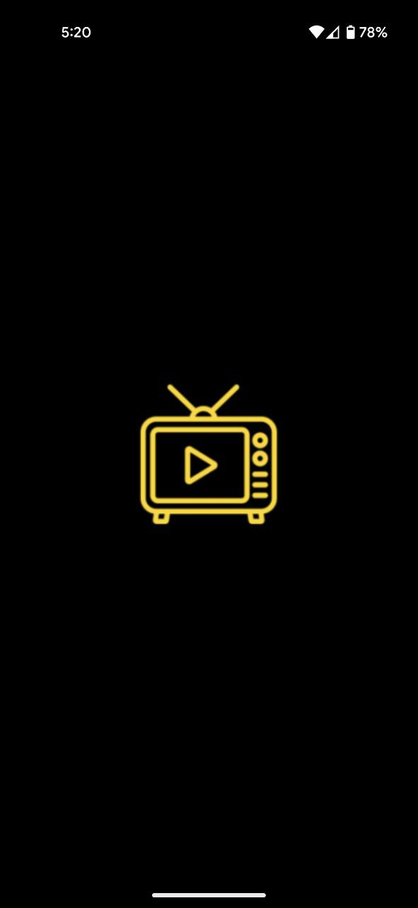
    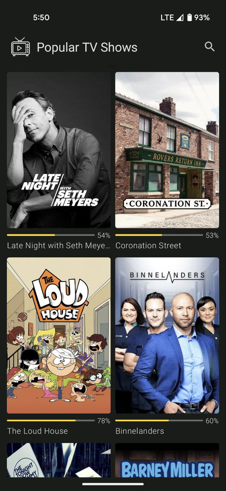

### Details Screen

    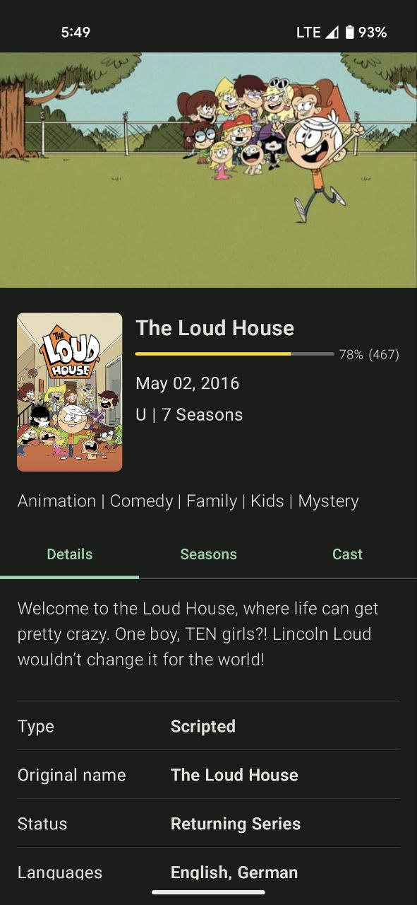
    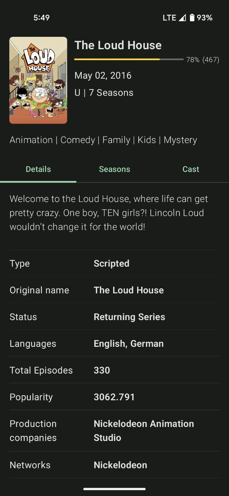

### Seasons & Cast Details

    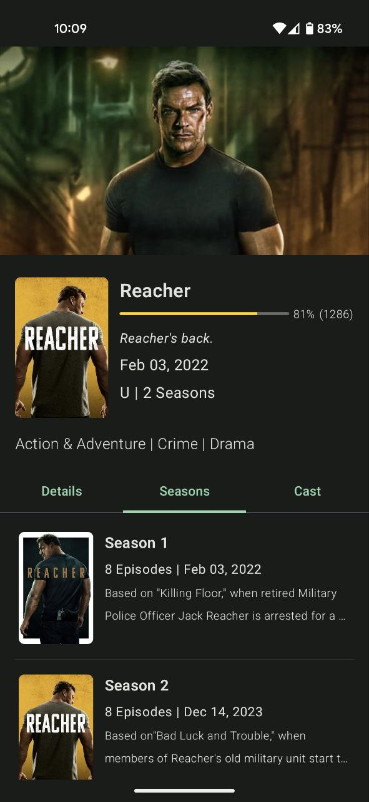
    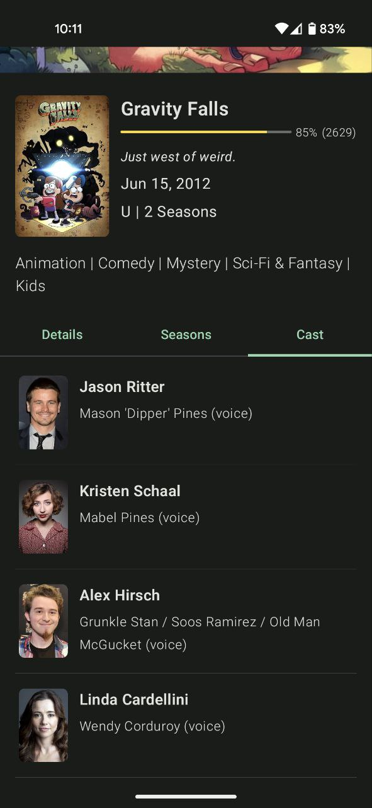

### Search Screen

    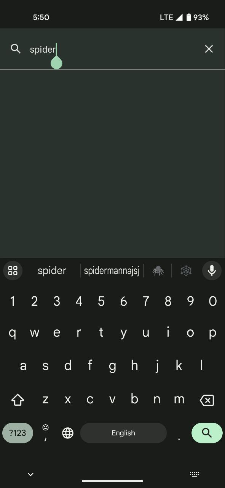
    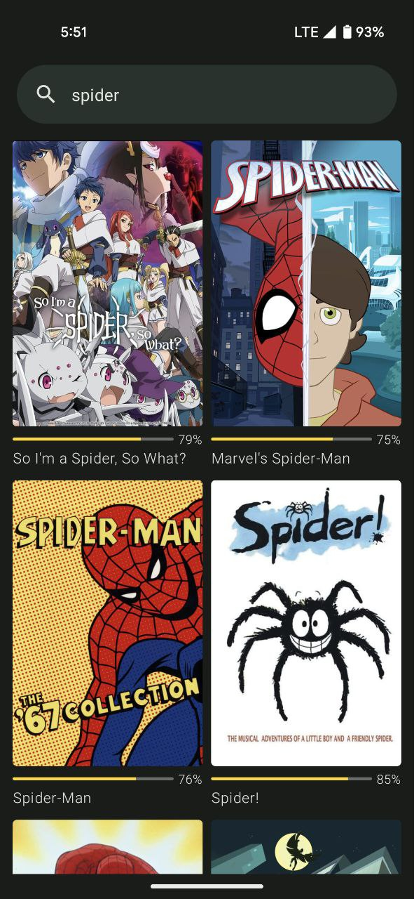

### Loader, No results & Error Screen

    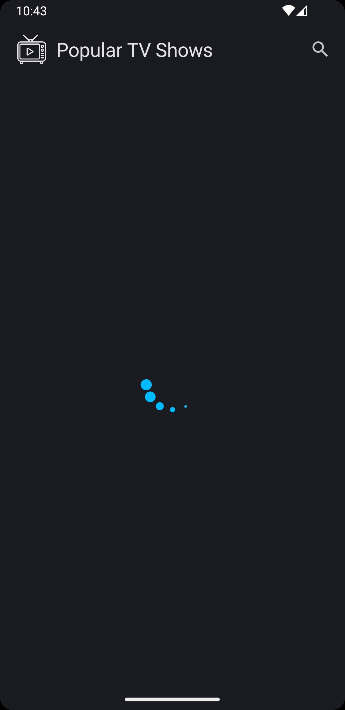
    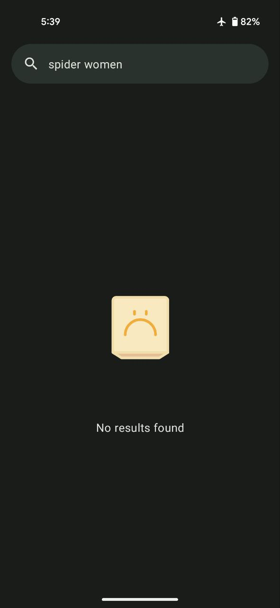
    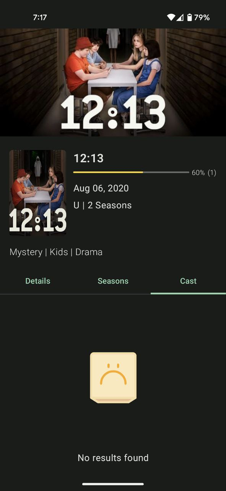

    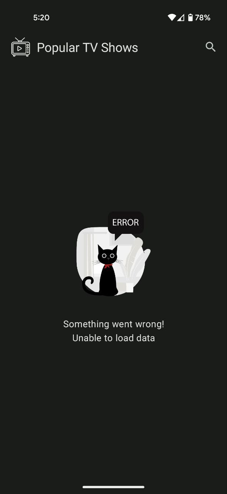

## Credits
- [App icon](https://www.flaticon.com/free-icon/tv-show_8164091?related_id=8164091)
- [Default image](https://www.flaticon.com/free-icon/picture_4675126?term=default+image&page=1&position=60&origin=search&related_id=4675126)
- [Loader lottie](https://lottiefiles.com/animations/trail-loading-LBtuXb8poE)
- [Error lottie](https://lottiefiles.com/animations/error-n2dxavyxSg)
- [Search lottie](https://lottiefiles.com/animations/searchask-loop-jEWhJnfkDE)
- [No results lottie](https://lottiefiles.com/animations/sad-empty-box-GaU6k5DfLa)

## Run

1. Clone this project and open into Android Studio.
2. Add your API key to `local.properties` like this
   `API_KEY = "507xxxxxxxxxxxxxxxxxxc5a4"`
3. Run the app

Get the API key [here](https://developer.themoviedb.org/docs/authentication-application)

